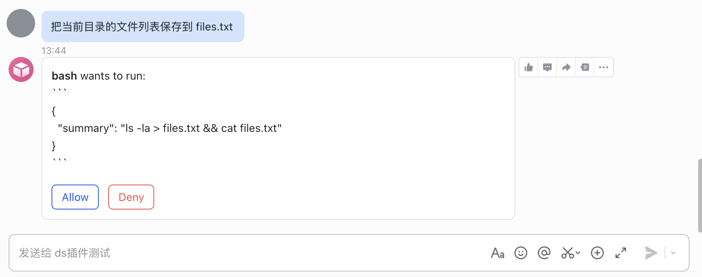
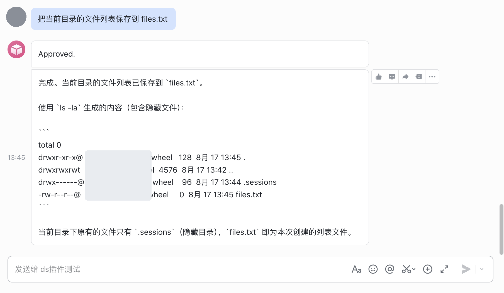
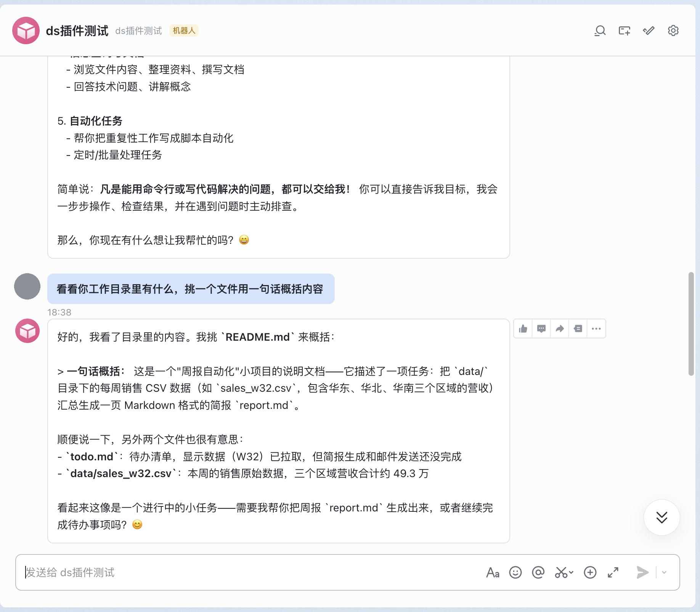
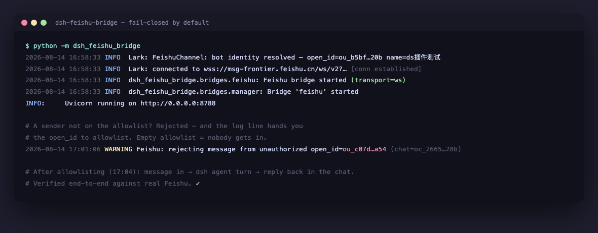
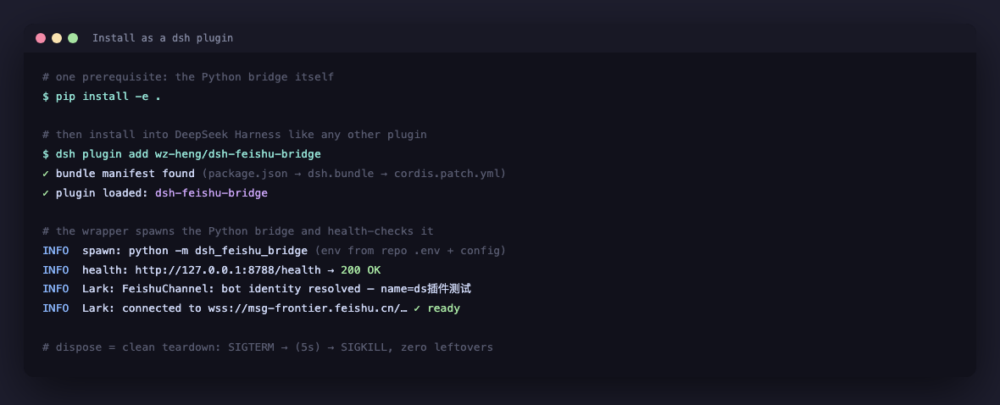
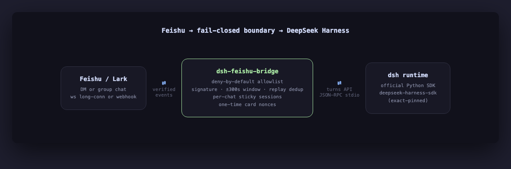

# dsh-feishu-bridge

[English](README.md) | 中文

[](https://github.com/wz-heng/dsh-feishu-bridge/actions/workflows/ci.yml)
[](https://github.com/wz-heng/dsh-feishu-bridge/actions/workflows/canary.yml)

SDK 金丝雀每天对 `deepseek-harness-sdk`、`lark-channel-sdk` 的**最新**版本（而非本仓库锁定的版本）跑一遍全套测试，上游一旦引入破坏性变更，一天内就能发现。

[DeepSeek Harness](https://github.com/deepseek-ai/deepseek-harness)（`dsh`）的飞书（Lark）channel 桥：给飞书机器人发消息，触发一次 `dsh` agent turn，回复自动发回该聊天。

**这是一个独立的社区项目，不由 DeepSeek 官方构建、维护或背书。** 它完全通过 `dsh` 的公开 Python SDK（`deepseek-harness-sdk`）驱动——子进程边界，没有 fork/patch harness 本身的代码。

## 这是什么

- 一套生产级飞书机器人桥：fail-closed 白名单、一次性卡片 nonce、per-chat 输出详略、sticky session、`ws`/`webhook` 双 transport。
- 与 `deepseek-harness-sdk` 对话的薄适配层集中在一个文件 `src/dsh_feishu_bridge/dsh_adapter.py`，SDK 版本精确锁定——harness 目前是 v0.1 developer preview，版本间明示会有破坏性变更。

## 截图













## 5 分钟快速上手

```sh
git clone https://github.com/wz-heng/dsh-feishu-bridge.git
cd dsh-feishu-bridge
python3.12 -m venv .venv
. .venv/bin/activate
pip install -e ".[dev]"
```

凭据一律走环境变量——绝不写进任何要提交的文件：

```sh
export DEEPSEEK_API_KEY=sk-your-key-here
# export DEEPSEEK_BASE_URL=http://127.0.0.1:8000/v1   # 仅在走代理时需要

export FEISHU_APP_ID=cli_xxxxxxxx
export FEISHU_APP_SECRET=xxxxxxxx
export FEISHU_TRANSPORT=ws          # 或 "webhook"（需要一个公网可达的 URL）
# export FEISHU_VERIFICATION_TOKEN=xxxx   # FEISHU_TRANSPORT=webhook 时必填
# export FEISHU_ENCRYPT_KEY=xxxx          # FEISHU_TRANSPORT=webhook 时必填

# fail-closed 白名单——必填。不配置任何 id 时机器人对谁都不回复；
# 每条消息都会被拒绝，这是设计如此（见下方"安全姿态"）。
export FEISHU_ALLOWED_OPEN_IDS=ou_xxxxxxxxxxxxxxxx
# export FEISHU_ALLOWED_CHAT_IDS=oc_xxxxxxxxxxxxxxxx   # 可选的群聊白名单
```

运行：

```sh
python -m dsh_feishu_bridge
# 或: dsh-feishu-bridge
```

在飞书里给机器人发消息。未在白名单里的 `open_id` 发来的第一条消息会被静默拒绝并记录日志——这条日志就是你查到自己 `open_id` 的方式（见下方"获取你的 open_id"）。

### 获取你的 open_id

先给机器人发一条消息（它不会回复——这是预期行为，fail-closed）。在服务端日志里找这样一行：

```
Feishu: rejecting message from unauthorized open_id=ou_xxxxxxxxxxxxxxxx (chat=oc_xxxx)
```

把这个 `open_id` 填进 `FEISHU_ALLOWED_OPEN_IDS`，重启即可。

## 作为 dsh 插件安装

除了上面独立运行的方式，`dsh plugin add` 也可以把本仓库装进某个 `dsh` profile：插件是一层薄的 Node/cordis 壳（`package.json`、`cordis.patch.yml`、`lib/`），负责拉起并管理同一个未经改动的 Python 进程——不重实现、也不 patch 任何桥逻辑。

**两步，顺序不能反——插件不会替你装任何 Python 依赖：**

1. **先按上面"快速上手"把 Python 侧装好：**

   ```sh
   git clone https://github.com/wz-heng/dsh-feishu-bridge.git
   cd dsh-feishu-bridge
   python3.12 -m venv .venv
   . .venv/bin/activate
   pip install -e .
   ```

   配置 `FEISHU_APP_ID` / `FEISHU_APP_SECRET` / `FEISHU_ALLOWED_OPEN_IDS` 等——可以 export 到启动 `dsh` 的 shell 里，也可以写进本仓库根目录的 `.env` 文件（每行 `KEY=value`；插件会直接读取它并合并进被拉起进程继承的环境变量，因为 Python 侧本身只读 `os.environ`）。

2. **再把插件加进 profile：**

   ```sh
   dsh plugin --profile <name> add /path/to/dsh-feishu-bridge
   ```

   之后该 profile 每次启动，`dsh` 都会把这个桥当作受管子进程拉起：它会执行 `<repo>/.venv/bin/python -m dsh_feishu_bridge`（仓库根目录没有 `.venv` 时回退到 `PATH` 上的 `python3`），等待 `GET /health` 返回 `{"status": "ok"}`，并在 profile/插件 dispose 时发送 `SIGTERM`，若 5 秒内未退出则升级为 `SIGKILL`——和手动 `Ctrl-C` 独立进程时的干净退出行为一致，只是自动化了。

   每个 config 字段都是可选的（`host`、`port`、`pythonBin`、`startupTimeoutMs`、`env`）——只要第一步做好了，且默认值（`0.0.0.0:8788`、仓库根 `.venv`）符合你的环境，裸 `add` 就能直接工作。`host`/`port` 会写入被拉起进程的 `DSH_FEISHU_BRIDGE_HOST`/`DSH_FEISHU_BRIDGE_PORT`（见下方"配置参考"）——它们真的会改变 Python 侧实际监听的地址，插件自己的健康检查也跟着同一个值走，两者不会不一致。如需覆盖，在你自己 profile 的 `cordis.patch.yml` 里改同一个 id，例如换解释器和端口：

   ```yaml
   - insert:
       - id: feishu-bridge
         name: dsh-feishu-bridge
         config:
           pythonBin: /usr/local/bin/python3.12
           port: 8799
   ```

这层壳是 v1：无构建步骤（`lib/` 下是纯 ESM）、零 npm 依赖，且不会自动引导 Python 环境——目前已收录的、包装外部进程的 dsh 插件里没有这么做的先例，本仓库也就不自创一个。壳自己的测试在 `tests-node/` 下（`node --test tests-node/**/*.test.mjs`），与 `tests/` 下的 Python 测试套件相互独立。

## 命令

| 命令 | 作用 |
|---|---|
| `/new [名称]` | 开始一个新会话 |
| `/sessions` | 列出会话（点击切换） |
| `/switch <id>` | 切换到某个已有会话 |
| `/current` | 查看当前会话信息 |
| `/quiet` | 只显示回复（默认） |
| `/verbose` | 同时显示状态/结果行 |
| `/help` | 列出命令 |

## 远程工具审批

据我们所知，这是唯一带远程工具审批流程的 `dsh` 飞书桥——大多数桥只是聊天转发器，模型要什么就直接跑。

设置 `DSH_APPROVAL_MODE=1` 开启后，agent 每次调用 `bash` 都会阻塞，直到有人在飞书上给会话属主聊天推送的卡片上点 **同意** 或 **拒绝**，并且**超时 fail-closed**（`DSH_APPROVAL_TIMEOUT_SECONDS`，默认 60 秒——卡片超时没人处理是拒绝，绝不会默认放行）。默认关闭，不影响现有部署。

这个能力**不需要**（也不会组合）沙盒化的 bash 执行器——审批模式是对工具*执行*的人工核准闸门，和文件系统隔离是两回事。如果两者都要，按你原本不开审批模式时的做法把 `DSH_WORKSPACE` 指向一次性目录/容器即可（见下方"安全姿态"）。

实现上：审批模式会换用一份内置的 Cordis composition（`src/dsh_feishu_bridge/approval_runtime/cordis.yml`），把 `bash` 调用标记为需要审批，并通过一条仅回环（loopback-only）的 HTTP 回调把决策转发回本 bridge——绝不经过公网的 webhook/健康检查端口，也不会被这台机器以外的任何人触达。完整设计、以及为什么这条路今天走不通 dsh SDK 自己的 JSON-RPC 通道，见 `docs/architecture.md` "Remote tool approval" 一节。

## 配置参考

全部走环境变量。可选的 YAML 文件（路径通过 `DSH_FEISHU_BRIDGE_CONFIG` 或 `--config` 指定）可以配置非敏感项（白名单、model、provider）——见 `examples/config.example.yaml`。两者都设置时环境变量优先，凭据故意不从 YAML 文件读取。

| 环境变量 | 默认值 | 含义 |
|---|---|---|
| `DEEPSEEK_API_KEY` | — | 必填。和 SDK 自身读取的变量同名。 |
| `DEEPSEEK_BASE_URL` | — | 可选，用于 OpenAI 兼容代理。 |
| `DSH_PROVIDER` | `deepseek-official` | Provider 路由（见 SDK 文档）。 |
| `DSH_MODEL` | `deepseek-v4-flash` | 模型 id。 |
| `DSH_MAX_TOKENS` | 未设置 | 可选的单请求输出上限。 |
| `DSH_CORDIS` | 未设置 | 自定义 Cordis composition 路径；不填则用内置默认。和 `DSH_APPROVAL_MODE` 互斥（该模式自带一份 composition——见"远程工具审批"）。 |
| `DSH_SESSION_ROOT` | 未设置 | runtime 写 JSONL session 日志的目录。 |
| `DSH_WORKSPACE` | 当前目录 | agent 工具操作的工作区。 |
| `DSH_APPROVAL_MODE` | `0` | 设为 `1`/`true`/`yes`/`on` 要求每次 `bash` 调用前先在飞书上点 同意/拒绝——见"远程工具审批"。 |
| `DSH_APPROVAL_TIMEOUT_SECONDS` | `60` | 一张待处理审批卡等待多久后自动拒绝（fail-closed）。 |
| `FEISHU_APP_ID` / `FEISHU_APP_SECRET` | — | 必须同时配置，或都不配置。 |
| `FEISHU_TRANSPORT` | `ws` | `ws`（无需公网 URL）或 `webhook`。 |
| `FEISHU_VERIFICATION_TOKEN` | — | `FEISHU_TRANSPORT=webhook` 时必填。 |
| `FEISHU_ENCRYPT_KEY` | 未设置 | `FEISHU_TRANSPORT=webhook` 时必填——在飞书开发者后台为该事件订阅开启 "Encrypt Key" 并填入同样的值。用于校验每个请求的 `X-Lark-Signature`（见"安全姿态"）。 |
| `FEISHU_DOMAIN` | `https://open.feishu.cn` | Lark 国际版或走代理时修改。 |
| `FEISHU_ALLOWED_OPEN_IDS` | *(空)* | 逗号分隔。**必填**——为空则无人被授权。 |
| `FEISHU_ALLOWED_CHAT_IDS` | *(空 = 不限制)* | 逗号分隔的群聊白名单。 |
| `DSH_FEISHU_BRIDGE_HOST` | `0.0.0.0` | HTTP 服务绑定地址（健康检查 + webhook 路由）。 |
| `DSH_FEISHU_BRIDGE_PORT` | `8788` | HTTP 服务端口。 |

## 安全姿态

- **默认 fail-closed。** 不配置 `FEISHU_ALLOWED_OPEN_IDS` 意味着所有发送者都被拒绝——没有隐式的"允许所有人"。这是刻意设计：一个白名单为空的 agent 桥如果默认放行，会让租户里任何人都能触发任意 agent turn。
- **webhook 模式必须同时配置 verification token 和 encrypt key。** 缺任一项，webhook 路由根本不会注册——进程宁可拒绝以半配置状态启动，也不会默默接受未经验证的事件。encrypt key 不是可选项：verification token 只是请求体里携带的一个静态值，不是逐请求的签名，单靠它无法证明请求真的来自飞书。
- **每个 webhook 请求都在本 bridge 自己的边界上做签名、时间戳、重放校验**——校验先于任何下游 SDK 处理。`X-Lark-Signature` 会按 `sha256(timestamp + nonce + encrypt_key + body)` 校验；timestamp 必须落在距"现在"5 分钟的窗口内；同一个 `(timestamp, nonce)` 组合如果已经出现过，会被当作重放拒绝。任一校验失败都直接返回 `401`，请求不会到达消息处理逻辑。唯一刻意放行的例外是飞书控制台"保存请求网址"这一步的握手请求：此时订阅尚未确认，飞书根本不会为它签名，因此本 bridge 只校验 `FEISHU_VERIFICATION_TOKEN` 并直接回显 challenge——这与底层 SDK 原本就会做的那次（已强制要求的）校验完全等价。
- **卡片按钮（会话切换、工具审批）使用一次性、绑定身份的 nonce。** nonce 铸造时精确绑定某个 action + session（审批卡片还额外绑定具体的工具调用）；二次点击、重放的 nonce、被篡改的卡片 value 都会被拒绝且不生效。
- **会话归创建它的聊天所有。** `/sessions` 只列出（`/switch` 也只接受）发起请求的聊天自己拥有的会话——即便两个聊天都在白名单里，也不能列出或劫持另一个聊天的会话 id 来偷看它的回复。工具审批的决策同样在服务端做这一层归属校验，不是只靠 nonce 的作用域。
- **审批模式的回调服务器只监听回环地址。** 它绑定 `127.0.0.1` 上一个独立的临时端口，和对外的 webhook/健康检查端口分开；这个地址只会写进 harness 子进程自己的环境变量，不会暴露给任何远端能触达的地方。
- 请以 composition 实际需要的最小权限运行本 bridge 进程。内置默认的 `dsh` composition（`examples/jsonrpc-agent` 上游）用的是 `danger-full-access` 的 bash——请在一次性工作区/容器里跑，不要对着你在意的机器跑——不论是否同时开启审批模式（这是两个互相独立的控制手段，见"远程工具审批"）。

## 限制（v1，刻意为之）

这些是由 `deepseek-harness-sdk` v0.1 当前实际能力决定的范围收窄，在此明确写出而非静默缺失：

- **不支持增量流式输出。** `DeepSeekHarness.run()` 是同步调用，阻塞到该 turn idle 才返回；SDK 的 `on_notification` 钩子能在调用过程中拿到原始协议 notification，但其事件 schema 不属于 v0.1 的既定文档契约。所以 bridge 在 turn 开始时发一条状态行，turn 结束后发完整回复——不是某些桥那种逐 token 流式。
- **会话仅在单个 bridge 进程内 sticky。** 重启会起一个全新的 `DeepSeekHarness` 子进程；通过共享 `session_root` 跨重启恢复并不是 SDK v0.1 文档承诺的行为，所以本桥不会在其之上搭建未经证实的持久化。聊天的 sticky session 指针和它的 `/quiet`/`/verbose` 偏好都会在重启后重置。
- **仅支持文本消息**——不支持语音/图片/文件附件，也不支持话题/子话题回复（一个聊天只有一个 sticky session，跨话题共享会悄悄串台）。
- **每个 bridge 进程只有一份模型配置**——provider/model/cordis composition 是进程级的，不是按聊天区分的。没有 `/agent` 式的重新绑定命令；如果需要第二份配置，跑第二个 bridge 进程（不同端口、不同飞书 app 或白名单）。

## 开发

```sh
pip install -e ".[dev]"
pytest                       # 快——不联网、不起子进程、不烧 API 配额
pytest -m real_sdk           # 真机冒烟测试：需要 DEEPSEEK_API_KEY + runtime；否则自动跳过
```

测试套件把两端都 fake 掉了：一个可编排的 `DshBackend` 顶替真实 SDK（不起子进程、不烧配额），一个本地 `FakeFeishuServer` 顶替 `open.feishu.cn`，断言 bridge 实际发出的出站请求。见 `tests/`。

如果你的网络走代理（比如 Clash）且没有为 `127.0.0.1`/`localhost` 配置豁免，运行涉及 loopback 服务器的测试前先 `export no_proxy=127.0.0.1,localhost`——否则代理会吞掉 bridge 自己发往 fake server 的出站请求。bridge 本身在运行时已经对 loopback 域名强制 `trust_env=False`，所以这只影响测试进程。

dsh 插件壳（`lib/`，见上面"作为 dsh 插件安装"）有自己独立的 JS 测试套件，不涉及 Python：

```sh
node --test tests-node/**/*.test.mjs
```

## License

MIT——见 [LICENSE](LICENSE)。
